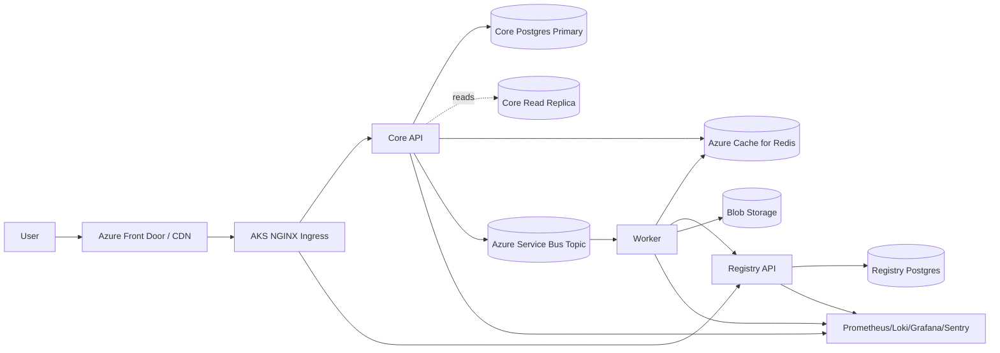

# RDash Senior DevOps Assignment

This repository is an Azure-first, production-oriented submission for the RDash Senior DevOps Engineer assignment. It implements the required foundation, a representative three-service vertical slice, RBAC and workload identity validation assets, and a detailed architecture document for the remainder of the platform.

## What is implemented

- Terraform foundation for Azure networking, AKS, Redis, PostgreSQL Flexible Server, Service Bus, storage, workload identity, and Helm-driven platform add-ons.
- Reusable Helm charts for cluster add-ons, service workloads, and the Part C RBAC validation pod.
- Three services that cover the required patterns:
  - `core`: ingress-exposed API, PostgreSQL read/write split, Redis cache-aside, Service Bus event publishing.
  - `registry`: HA pair behind ingress, own PostgreSQL database, edge-auth-ready route, service-to-service token verification.
  - `worker`: Service Bus consumer, Redis usage, registry lookup, Blob upload through workload identity.
- Production-focused documentation in [`docs/design.md`](/Users/anurag/rdash-devops-assignment/docs/design.md) and validation guidance in [`artifacts/validation/commands.md`](/Users/anurag/rdash-devops-assignment/artifacts/validation/commands.md).
- Bonus delivery assets: GitHub Actions CI/CD and Argo CD application manifests under [`/.github/workflows`](/Users/anurag/rdash-devops-assignment/.github/workflows/ci.yaml) and [`/argocd`](/Users/anurag/rdash-devops-assignment/argocd/project.yaml).

## Repository layout

```text
.
├── docs/
├── helm/
│   ├── charts/
│   └── values/
├── services/
│   ├── common/
│   ├── core/
│   ├── registry/
│   ├── validation/
│   └── worker/
└── terraform/
```

## Architecture summary



## Prerequisites

- Terraform `>= 1.8`
- Helm `>= 3.15`
- kubectl `>= 1.31`
- Docker `>= 26`
- Azure CLI `>= 2.72`
- Python `>= 3.12`

## Bootstrap

1. Copy `terraform/terraform.tfvars.example` to `terraform/terraform.tfvars`.
2. Copy `terraform/environments/dev/backend.hcl.example` to `terraform/environments/dev/backend.hcl`.
3. Create the remote state storage account and container referenced by the backend file.
4. Build and push images:

```bash
docker build -f services/core/Dockerfile -t ghcr.io/<org>/rdash-core:v0.1.0 .
docker build -f services/registry/Dockerfile -t ghcr.io/<org>/rdash-registry:v0.1.0 .
docker build -f services/worker/Dockerfile -t ghcr.io/<org>/rdash-worker:v0.1.0 .
docker build -f services/validation/Dockerfile -t ghcr.io/<org>/rdash-rbac-validation:v0.1.0 .
```

5. Initialize and apply Terraform:

```bash
cd terraform
terraform init -backend-config=environments/dev/backend.hcl
terraform plan -out tfplan
terraform apply tfplan
```

6. Install service releases after Terraform finishes:

```bash
helm dependency build helm/charts/platform-addons
helm upgrade --install core helm/charts/rdash-service -n rdash --create-namespace -f helm/values/core.yaml
helm upgrade --install registry helm/charts/rdash-service -n rdash -f helm/values/registry.yaml
helm upgrade --install worker helm/charts/rdash-service -n rdash -f helm/values/worker.yaml
helm upgrade --install rbac-validation helm/charts/rbac-validation -n default
```

7. Optional GitOps bootstrap for the bonus section:

```bash
kubectl apply -n argocd -f argocd/project.yaml
kubectl apply -n argocd -f argocd/platform-addons-app.yaml
kubectl apply -n argocd -f argocd/rdash-apps.yaml
```

## Design and operational notes

- AKS worker nodes run only in private subnets. Public traffic terminates at ingress, not on nodes.
- Services run with explicit CPU and memory requests and limits to keep scheduling and autoscaling predictable.
- Registry ingress is prepared for edge-auth enforcement through NGINX `auth-url` integration with an identity-aware proxy.
- The worker uses AKS Workload Identity for Blob access rather than embedding credentials.
- Runtime secrets are delivered by `ExternalSecret` resources instead of ConfigMaps or plaintext Helm values.
- The network policy baseline is default-restrictive. Each release opens only the destinations it needs.

## Validation

The command set for Part C and suggested smoke tests are in [`artifacts/validation/commands.md`](/Users/anurag/rdash-devops-assignment/artifacts/validation/commands.md). Screenshots are intentionally not fabricated in-repo; they should be captured from a real deployment.
For live evidence capture, run [`scripts/capture_validation.sh`](/Users/anurag/rdash-devops-assignment/scripts/capture_validation.sh) after the validation pod is ready.

## Cost estimate

- Small: `$1.9k` to `$2.4k` per month
- Medium: `$4.8k` to `$6.2k` per month
- Large: `$11k` to `$14k` per month

Primary cost levers are AKS node count and VM family, Service Bus premium namespace count, and PostgreSQL/Redis sizing.

## Time allocation

- Part A foundation: `8h`
- Part B vertical slice: `6h`
- Part C RBAC validation: `2h`
- Part D design document: `5h`

## Cleanup

```bash
cd terraform
terraform destroy
```

Manual cleanup may be required only for externally managed DNS records or public registry images.

## Submission Checklist

- Push this repository to GitHub with meaningful commits.
- Replace placeholder GHCR image references with your published images.
- Run a real Azure deployment and save command outputs under `artifacts/validation/run-<timestamp>/`.
- Capture Grafana, RBAC validation, and workload identity screenshots for the final submission bundle.
- Fill in the final public GitHub repo URL in Argo CD manifests if you use the bonus GitOps path.
